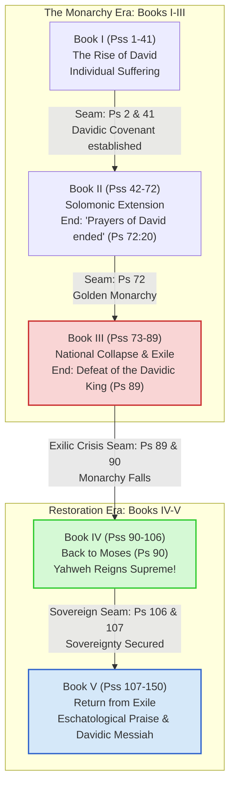

# The Structural Architecture and Theological Narrative of the Book of Psalms

## 1. Introduction & Overview
For centuries, readers of the Bible viewed the Book of Psalms (the *Psalter*) as a beautiful but unstructured anthology—a theological "hymnbook" compiled haphazardly for temple worship. In the early 20th century, form critics like Hermann Gunkel categorized individual psalms by their literary genres (such as laments, hymns, and thanksgiving songs), while cultic historians like Sigmund Mowinckel sought to reconstruct their functional role in Israel’s rituals.

However, a major paradigm shift occurred in the late 20th century. Led by the rise of **canonical criticism**—pioneered by Brevard Childs and famously developed by **Gerald H. Wilson** in his landmark 1985 study *The Editing of the Hebrew Psalter*—modern scholarship now recognizes the Book of Psalms as a single, highly structured, and carefully curated literary work. The 150 canonical psalms are not placed randomly; they follow a deliberate theological and historical "plot" that guides the reader on a journey from distress and exile to redemption, sovereign hope, and uninhibited praise.

This study explores the multi-layered structure of the Psalter, detailing its primary five-book division, its Torah-parallel framework, its overarching covenantal narrative, and the micro-collections embedded within its pages.

---

## 2. The Five-Book Macrostructure and Doxologies
The primary structural feature of the Psalter is its division into **five distinct books**. This five-fold macrostructure is marked by strategically placed, editorial **doxologies** (formal expressions of praise to Yahweh) that conclude the final psalm of each of the first four books. 

Below is a detailed analysis of the five books, including the specific Scripture doxologies retrieved directly from local biblical text databases (ESV2016 translation):

| Book | Psalms | Primary Authorial/Group Associations | Key Theological Tone | Concluding Doxical Seam & Scripture Text |
| :--- | :--- | :--- | :--- | :--- |
| **Book I** | Psalms 1–41 | Primarily Davidic (37 psalms) | Individual distress, personal trust, and the struggle of the righteous. | **Psalm 41:13**<br><blockquote>"Blessed be the LORD, the God of Israel, from everlasting to everlasting! Amen and Amen."</blockquote> |
| **Book II** | Psalms 42–72 | Sons of Korah (42–49), Asaph (50), David (51–71), Solomon (72) | National representation, expansion of royal rule, and cries for deliverance. | **Psalm 72:18–19**<br><blockquote>"¹⁸ Blessed be the LORD, the God of Israel, who alone does wondrous things. ¹⁹ Blessed be his glorious name forever; may the whole earth be filled with his glory! Amen and Amen!"</blockquote> |
| **Book III** | Psalms 73–89 | Hostile surroundings, Asaph (73–83), Sons of Korah (84–85, 87–88), Heman/Ethan (88–89) | National crisis, community lament, the devastation of Jerusalem, and exile. | **Psalm 89:52**<br><blockquote>"Blessed be the LORD forever! Amen and Amen."</blockquote> |
| **Book IV** | Psalms 90–106 | Moses (90), anonymous (91–102), Davidic (103–104), historical (105–106) | Shifting trust from fragile human kings to Yahweh's eternal, heavenly throne. | **Psalm 106:48**<br><blockquote>"Blessed be the LORD, the God of Israel, from everlasting to everlasting! And let all the people say, 'Amen!' Praise the LORD!"</blockquote> |
| **Book V** | Psalms 107–150 | Post-exilic congregation, Davidic (15 psalms), Songs of Ascents (120–134) | Return from exile, communal reconstruction, thanksgiving, and crescendo of praise. | **Psalms 146–150**<br>No single-verse doxology exists at the end of Book V because the entire final run of five "Hallelujah" psalms acts as a massive doxological finale for the entire Psalter. |

---

## 3. The Torah Parallel: Theological Purpose
In ancient Jewish tradition, the five-fold division of the Psalms was recognized as an intentional parallel to the Five Books of Moses (**the Pentateuch or Torah**). The ancient rabbinic commentary *Midrash Tehillim* (on Psalm 1:1) states:
> *"Moses gave to the Israelites the five books of the Law; and corresponding with these, David gave them the five books of the Psalms."*

This structural parallel serves a profound theological purpose: it signals that **the Psalms are not merely words spoken *to* God in praise, but are divine instruction (*Torah*) spoken *from* God to people.** 

The editors of the Psalter immediately establish this hermeneutical key at the gateway of the collection:
* **Psalm 1 (The Gateway):** This psalm does not contain a single petition or song of praise. Instead, it is a wisdom instruction concerning the "two ways" of life, commanding the faithful to delight in and meditate on the law (*Torah*) of the Lord "day and night" (Ps 1:2). 
* **The Hermeneutical Lens:** By placing a Torah/Wisdom psalm at the very introduction, the final redactors of the Psalter invite readers to treat the 150 prayers not just as music, but as holy instruction to be studied, memorized, and meditated upon.

---

## 4. The "Plot" of the Psalter: The Gerald Wilson Seams Thesis
Prior to the work of Gerald Wilson, scholars struggled to explain why certain psalms were placed where they were. Wilson discovered that the transition points or "seams" of the five books are characterized by **Royal Psalms** (psalms concerning the earthly king of David's line). 

His canonical-critical analysis revealed that the Psalter possesses an overarching narrative—a "plot" that tracks the theological history of Israel's Davidic covenant: the rise, the tragic fall, and the eschatological transformation of their hope.



### Phase 1: The Monarchy Era (Books I–III)
* **Book I: Establishment of the Davidic Ideal (Pss 1–41)**
  Following the Torah-gateway of Psalm 1, **Psalm 2** introduces the Lord's "anointed" king ruling in Zion. Together, Psalm 1 and Psalm 2 form an *inclusio* (both beginning and ending with the word "blessed"; cf. Ps 1:1, Ps 2:12), tying the Torah (instruction) and the Messiah (kingship) together. Book I consists of individual prayers of distress, revealing David as a suffering king who remains faithful through trial.
* **Book II: The Golden Reign and the Solomonic Zenith (Pss 42–72)**
  This collection moves from individual focus to corporate and national struggles. It traces the extension of Israel's borders and concludes with **Psalm 72**, a royal psalm attributed to Solomon, depicting a glorious, global, and righteous peaceful rule. The book ends with the editorial comment: *"The prayers of David, the son of Jesse, are ended"* (Ps 72:20), indicating David's final charge to his heir.
* **Book III: The Catastrophe of the Exile (Pss 73–89)**
  This is the darkest book of the Psalter, dominated by national laments (e.g., Psalm 74 and 79 lamenting the destruction of the Temple). It reaches its absolute theological crisis in **Psalm 89**. While the psalm begins by recounting God's eternal covenant with David (Ps 89:3-4), it ends with a harrowing lament over the deposition of the king and the fall of Jerusalem: *"But now you have cast off and rejected; you are full of wrath against your anointed. You have renounced the covenant with your servant; you have defiled his crown in the dust"* (Ps 89:38-39). The book ends with a simple, desperate doxology (Ps 89:52), leaving Israel in the ruins of the Babylonian exile.

### Phase 2: Post-Exilic Restoration & Sovereign Adaptation (Books IV–V)
* **Book IV: The Shift to Yahweh’s Heavenly Kingship (Pss 90–106)**
  Book IV is the strategic response to the exilic crisis. It begins with **Psalm 90**, the *only* psalm in the entire Psalter written by **Moses**. By bringing the reader back to Moses, the editors dramatically shift Israel's perspective: *even if we have no Davidic king, no temple, and no land, God was our dwelling place before the monarchy ever existed.* 
  Following this, the central collection of Book IV (Psalms 93–99, key "Enthronement Psalms") proclaims the eternal message: **"Yahweh reigns!"** (cf. Ps 93:1, 96:10, 97:1). Israel's trust is transferred from failing human, earthly kings of David's line to their true Sovereign King: God Himself.
* **Book V: Return, Rebuilding, and Eschatological Praise (Pss 107–150)**
  Having anchored hope in God's eternal kingship, Book V celebrates the historical reality of the return from exile, beginning with **Psalm 107**: *"Let the redeemed of the LORD say so, whom he has redeemed from trouble and gathered in from the lands..."* (Ps 107:2-3). It features massive corporate songs of reconstruction and worship, including the Pilgrimage songs (*Songs of Ascents*, Psalms 120–134) and the monumental praise of the law (*Psalm 119*). 
  In this final phase, the Davidic hope is not abandoned, but it is elevated into a future-focused, eschatological, and messianic reality (expressed in the royal-messianic Psalm 110: *"The LORD says to my Lord: 'Sit at my right hand, until I make your enemies your footstool'"*).

---

## 5. Movement from Lament to Praise
Underlying the historical story is a distinct psychological and emotional shift across the Psalter's macrostructure. German biblical scholar Claus Westermann famously demonstrated that the overall emotional architecture of the Psalms moves systematically **from Lament to Praise**.

```
   ------------------------------------------------------------>
      Books I - III                          Books IV - V
   Dominant: Lament                       Dominant: Praise
  (Individual, Confession, Crisis)      (Thanksgiving, Creation, Hallelujah)
```

In Books I–III, laments represent the vast majority of the text, expressing grief, betrayal, persecution, abandonment, and confusion. However, from Book IV onward, the dark clouds break. Laments occur rarely, replaced by national histories of gratitude, songs of creation, liturgical litanies, and expressions of pure joy. 

The structure proves that the Book of Psalms is designed to walk the believer through the full spectrum of suffering, leading them safely out into a world of ultimate doxology. This movement culminates in the final five psalms (**Psalms 146–150**), which each begin and end with the Hebrew command *Hallelujah!* ("Praise the LORD!"). Psalm 150 serves as the ultimate, universal crescendo of praise, declaring in its final verse:
> *"Let everything that has breath praise the LORD! Praise the LORD!"* (Ps 150:6).

---

## 6. Micro-Collections and Ancient Sub-Structures
While the five-book division represents the grand theological frame, the editors of the Psalter preserved several pre-existing, historically distinct "micro-collections" that reflect the diverse worship practices of ancient Israel:

1. **The Elohistic Psalter (Psalms 42–83):**
   This continuous block of psalms is characterized by a strong preference for the general name of God, *Elohim*, over the personal covenant name of God, *Yahweh*. For example, Psalm 53 is almost an exact duplicate of Psalm 14, but swaps *Yahweh* for *Elohim*. This suggests that the redactors integrated a pre-existing northern collection.
2. **The Korahite Collection (Psalms 42–49, 84–85, 87–88):**
   Composed by the "Sons of Korah," a guild of temple musicians and gatekeepers. These psalms are notable for their deep longing for the presence of God in Jerusalem and the sanctuary (e.g., Psalm 42 and Psalm 84: *"How lovely is your dwelling place, O LORD of hosts!"*).
3. **The Asaphite Collection (Psalms 50, 73–83):**
   Associated with Asaph, David's chief choir leader. These psalms have a highly communal, prophetic, and covenantal tone, often focusing on God as the Righteous Judge who holds the nations accountable.
4. **The Songs of Ascents (Psalms 120–134):**
   Also known as the "Pilgrim Psalms" or "Songs of the Stairs." These fifteen short songs were sung by Israelites as they made their physical trek up to Jerusalem for Jewish festivals. They describe themes of journeying, protection, community unity, and worship on Zion.
5. **The Hallelujah Psalms (Psalms 111–113, 146–150):**
   Liturgical collections that begin and/or end with the phrase "Praise the LORD." They are heavily focused on praise, God's historical wonders, and creation's response.
6. **Acrostic Psalms (Psalms 9, 10, 25, 34, 37, 111, 112, 119, 145):**
   These psalms use alphabetic acrostic structures, where consecutive verses (or strophes) begin with successive letters of the Hebrew alphabet. The massive Psalm 119 is the ultimate example, containing 22 sections corresponding to the 22 letters of the Hebrew alphabet, with each section consisting of 8 verses beginning with that specific letter. Acrostic structures were used for memory assistance and to symbolize the complete, perfect exhaustion of a topic from "A to Z" (or *Aleph* to *Tav*).

---

## 7. Spiritual and Practical Application
The intentional structure of the Psalter offers vital spiritual lessons for modern readers:

* **The Integration of Word and Worship:**
  By linking Psalm 1 (Torah) and Psalm 2 (Messiah) together as the dual gateway, the Bible teaches that true prayer cannot be divorced from theology. Our worship must be fueled by a deep meditation on God's word, and our Bible study must naturally erupt into praise and petition.
* **A Sanctuary for All Seasons of Soul:**
  The structural progression from lament to praise shows that God does not expect cheap, cheerful, or plastic expressions of optimism. Nearly half of the Psalter is written in minor keys, modeling for us how to pour out raw anger, grief, and confusion before a holy God. Yet, by structuring the book toward a finale of uninhibited praise, God assures us that while "weeping may tarry for the night, joy comes with the morning" (Ps 30:5).
* **Anchoring Faith in the King of Kings:**
  When our personal lives, nations, or societies collapse into chaos—just as Israel did in Book III—we can look to Book IV and V. We are reminded that when earthly systems or political dynasties fail, our ultimate anchor remains secure on the throne of Zion: **Yahweh reigns forever.**

---

## Conclusion
The Book of Psalms is not a random pile of spiritual ruins. It is a gloriously constructed cathedral. It has a beautiful entry gate (Psalms 1 and 2), a detailed physical floor-plan (the five books mimicking the Torah), a historical journey exploring the rise and tragic fall of earthly expectations (Books I–III), a theological rescue and transfer of focus to God's eternal kingdom (Book IV), and a magnificent choir loft projecting a final, eternal crescendo of praise (Book V; Psalms 146–150). It invite us to enter, join the prayers, and lift up our voices to the Sovereign King.
