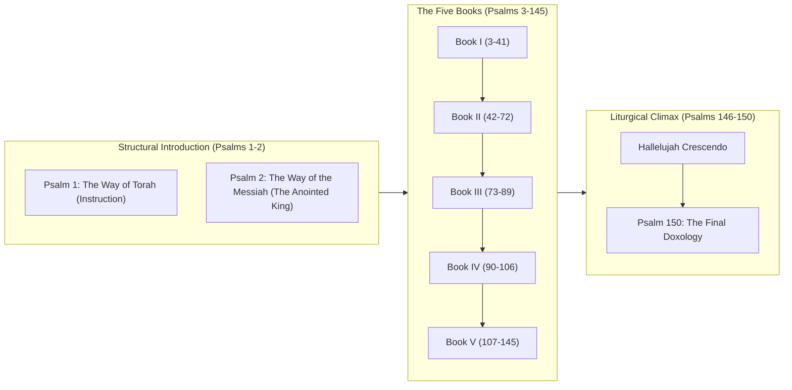

# The Structural Architecture of the Book of Psalms (Tehillim)

*An academic, exegetical, and theological analysis of the organization, groupings, and structural development of the Hebrew Psalter.*

---

## I. Introduction: The Name and Nature of the Psalter

The Book of Psalms, known in the Hebrew Bible as **סֵפֶר תְּהִלִּים** (*Sefer Tehillim* – "The Book of Praises") or simply *Tehillim*, serves as the devotional and liturgical centerpiece of the Old Testament. While the English title "Psalms" originates from the Greek Septuagint translation **Ψαλμοί** (*Psalmoi* – "songs sung to stringed instruments"), the Hebrew name more accurately captures the ultimate theological destination of the work: praise.

Structurally, the Psalter is not a random anthology of ancient religious poetry compiled haphazardly over Israel's history. It is a highly organized, single literary composition structured with care. Its structure functions as both a reflection of Israel's redemptive history and a handbook of covenantal life, offering a deliberate path from lament to praise, anchored in the Law (*Torah*) and the Hope of the Messianic King (*Messiah*).

---

## II. The Macro-Structure: The Pentateuchal Pattern (The Five Books)

The most prominent macro-structural feature of the Book of Psalms is its division into **Five Books**. This deliberate design mirrors the fivefold division of the Law of Moses (the Pentateuch/Torah), representing a "Response-Torah" where God's people interact with of God's instructions in song.

Each of the five books has distinct characteristics and ends with a formal liturgical doxology (a blessing of Israel's God) and a double affirmation ("Amen and Amen" or "Praise the Lord").

### Summary Table of the Five-Book division

| Book | Psalms | Major Authorship Attributions | Dominant Divine Name | Thematic Correlation to Torah | Ending Doxology Verse |
| :--- | :--- | :--- | :--- | :--- | :--- |
| **Book I** | Psalms 1–41 | Primarily Davidic (37) | Yahweh (The Lord) | **Genesis** (creation, humanity, fall & deliverance) | Psalm 41:13 |
| **Book II** | Psalms 42–72 | Sons of Korah (7), David (18), Solomon (1) | Elohim (God) | **Exodus** (covenant, exile, redemption & temple) | Psalm 72:18-20 |
| **Book III** | Psalms 73–89 | Asaph (11), Sons of Korah (3) | Elohim & Yahweh mix | **Leviticus** (holiness, sanctuary, distress & community) | Psalm 89:52 |
| **Book IV** | Psalms 90–106 | Moses (1), Anonymous (14) | Yahweh (The Lord) | **Numbers** (wilderness, fleeting human life, God's reign) | Psalm 106:48 |
| **Book V** | Psalms 107–150| Davidic (15), Ascent (15), Anonymous (28)| Yahweh (The Lord) | **Deuteronomy** (re-entering land, Torah, universal praise) | Psalm 150:1-6 (Entire Psalm) |

---

## III. The Doxological Seals of the Five Books

These five books are marked off by beautiful doxological conclusions. To preserve scripture integrity, we quote these directly as fetched from the database:

### End of Book I (Psalm 41:13)
> "The Lord God of Israel deserves praise in the future and forevermore! We agree! We agree!" (NET)
*Note: The Hebrew parallel phrase translated here as "We agree! We agree!" is the double **אָמֵן וְאָמֵן** ("Amen and Amen").*

### End of Book II (Psalm 72:18–20)
> "The Lord God, the God of Israel, deserves praise! He alone accomplishes amazing things! His glorious name deserves praise forevermore! May his majestic splendor fill the whole earth! We agree! We agree! This collection of the prayers of David son of Jesse ends here." (NET)
*Note: This specific closing signature ("The prayers of David son of Jesse are ended") indicates that Book II served at one point as an independent, early collection of Davidic prayers.*

### End of Book III (Psalm 89:52)
> "The Lord deserves praise forevermore! We agree! We agree!" (NET)
*Note: This doxology provides a sharp, hopeful note contrasting with the heavy lament of Psalm 89 regarding the apparent failure of the Davidic throne in exile.*

### End of Book IV (Psalm 106:48)
> "The Lord God of Israel deserves praise, in the future and forevermore. Let all the people say, 'We agree! Praise the Lord!'" (NET)
*Note: Instead of a simple "Amen," this doxology incorporates the congregation: "Let all the people say, 'Amen! Hallelujah!'"*

### End of Book V & The Entire Psalter (Psalm 150)
Rather than a single concluding verse, the entire final psalm functions as a majestic, instruments-and-choir doxology that seals the entire collection of 150 psalms:
> "Praise the Lord! Praise God in his sanctuary! Praise him in the sky, which testifies to his strength! Praise him for his mighty acts! Praise him for his surpassing greatness! Praise him with the blast of the horn! Praise him with the lyre and the harp! Praise him with the tambourine and with dancing! Praise him with stringed instruments and the flute! Praise him with loud cymbals! Praise him with clanging cymbals! Let everything that has breath praise the Lord! Praise the Lord!" (NET)

---

## IV. The Twin Pillars: The Structural Frame

The book has a deliberate structural border or "bracket"—formed by a two-psalm introduction and a five-psalm concluding crescendo.



### 1. The Proem (Psalms 1 and 2 as the Double Gateway)
These two psalms have no title or superscript (such as "A Psalm of David"), separating them from the body of Book I. Together, they form an editorial preface that introduces the twin themes driving the theology of the Psalter:
* **Psalm 1 (Torah Theme)**: Focuses on meditation on the Law of God as the source of life and blesses the upright while warning the wicked. It opens with **אַשְׁרֵי־הָאִישׁ** (*Ashrei ha-ish* – "How blessed is the man").
* **Psalm 2 (Messianic/Kingship Theme)**: Focuses on God's covenant on Mount Zion and His chosen King/Messiah, in the face of rebel nations. It closes with **אַשְׁרֵי כָּל־חוֹסֵי בוֹ** (*Ashrei kol-chosei vo* – "How blessed are all who take refuge in Him").
* Combined, they outline the life of the faithful: walking according to God's instruction (Torah) and resting under God's sovereign ruler (Messiah).

### 2. The Final Hallel (Psalms 146–150)
The entire Psalter ends with a fivefold crescendo of pure praise. Psalms 146, 147, 148, 149, and 150 each begin and end with the Hebrew command **הַלְלוּ־יָהּ** (*Hallelujah* – "Praise Yahweh"). These psalms contain no petitions, no complaints, and no laments—signaling that praise is the ultimate destination of human prayer.

---

## V. Major Sub-Collections and Editorial Groupings

Within the Five Books, scholarly editors grouped certain psalms together into recognizable "hymnbooks within the hymnbook."

### 1. The Elohistic Psalter (Psalms 42–83)
Scribal editors collected these psalms from Book II and Book III. In this section, there is a strong preference for the generic name **אֱלֹהִים** (*Elohim* – "God") rather than the covenant name **יהוה** (*Yahweh* – "the LORD"). For instance, Psalm 53 is a nearly identical adaptation of Psalm 14, but with "Elohim" systematically substituted for "Yahweh."

### 2. The Songs of Ascents (Psalms 120–134)
Also known as the "Pilgrim Songs" or "Songs of degrees," each of these fifteen psalms bears the subscript **שִׁיר הַמַּעֲלוֹת** (*Shir Hamma'alot* – "A Song of Ascents"). These were sung by pilgrims marching up the steep winding roads to Jerusalem for the three annual festivals (Passover, Pentecost, and Tabernacles). They are characterized by their brevity, rhythmic repetition, and themes of Zion, farming, family, and peaceful trust inside the city walls.

### 3. The Egyptian Hallel (Psalms 113–118)
This collection was sung by the Jewish community during key pilgrim feasts, particularly during the Passover meal (where Psalms 113-114 were sung before the meal and Psalms 115-118 after the cup of redemption). It commemorates God's deliverance of Israel from Egyptian bondage.

### 4. Author-Based Collections
* **The Davidic Collections**: David's name is associated with 73 psalms in the Hebrew Bible. Most of Book I (3–41) is Davidic. There is a second block in Book II (51–70), and another in Book V (138–145).
* **The Asaph Collections**: Asaph, a levitical choir director appointed by David (1 Chron 16:5), is attributed with 12 psalms: Psalm 50 and most of Book III (Psalms 73–83). These tend to have corporate, national, prophetic, and warning tones.
* **The Korahite Collections**: The Sons of Korah, a guild of temple gatekeepers and singers (1 Chron 9:19), represent 11 psalms in Book II (42, 44-49) and Book III (84-85, 87-88). These show deep devotion to Zion and the physical courts of God's temple (e.g., Psalm 84).

---

## VI. Genre Structure (Form-Critical Layout)

Hermann Gunkel, the prominent German Old Testament scholar, pioneered "form criticism" (*Formgeschichte*) by classifying individual psalms according to their literary genre (*Gattung*). These literary structures define how individual psalms are internally organized:

### 1. Laments (The Most Frequent Genre)
Laments comprise over one-third of the Psalter and are structured into two categories: **Individual Laments** (a person facing illness, false accusations, or enemies) and **Corporate/National Laments** (the community facing defeat, plague, or exile).
* **Internal Structure of a Lament**:
  1. *Invocation* (Cry to God)
  2. *Description of Distress* (The problem: enemies, spiritual crisis, physiological pain)
  3. *Profession of Trust* ("Yet I know that You...")
  4. *Petition* (Ask specifically for rescue or justice)
  5. *Vow of Praise* (Promise to worship publically once delivered)

### 2. Hymns of Praise
These are focus-directed declarations of worship celebrating God's nature, His creation, and his actions in history.
* **Internal Structure of a Praise Hymn**:
  1. *Call to Worship* (Exhortation to praise)
  2. *Reason for Praise* (The "for" or "because" clauses: "for He is good," "He made the heavens")
  3. *Renewed Call to Praise* (Conclusion)

### 3. Thanksgiving Psalms
These are distinct from praise hymns because they celebrate a *specific, historical narrative answer to prayer*—the fulfillment of a lament's vow.
* **Internal Structure of Thanksgiving**:
  1. *Proclamation of Intention to Praise*
  2. *Historical Narrative* (The distress, the prayer, and the rescue)
  3. *Declaration of Deliverance*
  4. *Offering or Public Testimony*

---

## VII. The Theological Arc: From Lament to Praise

The ultimate genius of the Psalter's organization is not merely static classification, but its dynamic **movement**. 

When reading the Psalter from Book I through Book V, a dramatic theological and emotional shift takes place:

```
[Books I - III]                                                 [Books IV - V]
Heavy Laments, -----------------------------------------> Triumphant Praise,
Personal Grief, Soul-Searching,                           Corporate Rejoicing,
Fleeing from Enemies                                      The Reign of Yahweh
```

* **Personal to Communal**: Individual voices of suffering (represented by David fleeing Saul or Absalom in Books I and II) gradually expand into communal choral praises (represented by the pilgrim songs and Hallelujah choruses of Book V).
* **Lament to Praise**: Books I, II, and III are heavily saturated with laments of distress, searching, and questions of the exile (e.g., Psalm 88, the darkest psalm, ends in "darkness is my only friend"). Books IV and V answer this darkness with the declaration: "The Lord reigns!" (Psalms 93–99). 
* **The Victory of Hallelujah**: Petition and mourning are progressively transformed. The final five psalms delete petition altogether, leaving only pure, uncompromised, and endless celebration. In this, the structure of the Psalms matches the path of faith: from tears of repentance and suffering, through historical wandering, to the eternal praise of God's presence.
