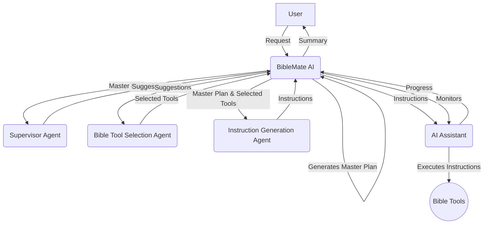

# Create BibleMate Skill and a Slash Command /biblemate

Ok, here comes to the most important skill in this project.  I want the AI to behave like a Bible scholar, and it will use the BibleMate AI to help it complete the task.

I want you to create a `biblemate` skill and a slash command `/biblemate`.

This slash command is the main entry point for the BibleMate AI.  It will be used to complete the task.

This skill orchestrates the entire BibleMate AI workflow with all the available tools and skills that are relevant for resolving the user's request.

When this skill runs, it will first check all the available skills, instead of static skill list, as users may dynamically add or remove skills from time to time.

Below is the workflow diagram and the description of each step that I originally developed for the BibleMate AI project.  You read this first.  I would like you to further advance and make the workflow perfect with improvements, that I will give you.

## 🧩 BibleMate AI Workflow

1.  **BibleMate AI** receives a request from a user.
2.  **BibleMate AI** analyzes the request and determines that it requires multiple steps to complete.
3.  **BibleMate AI** generates a `Master Plan` that outlines the steps needed to complete the request.
4.  **BibleMate AI** sends the `Master Plan` to a supervisor agent, who reviews the prompt and provides suggestions for improvement.
5.  **BibleMate AI** sends the suggestions to a bible tool selection agent, who selects the most appropriate bible tools for each step of the `Master Plan`.
6.  **BibleMate AI** sends the selected bible tools and the `Master Plan` to an instruction generation agent, who converts the suggestions into clear and concise instructions for an AI assistant to follow.
7.  **BibleMate AI** sends the instructions to an AI assistant, who executes the instructions using the selected bible tools.
8.  **BibleMate AI** monitors the progress of the AI assistant and provides additional suggestions or instructions as needed.
9.  Once all steps are completed, **BibleMate AI** provides a concise summary of the results to the user.
10. The user receives the final response, which fully resolves their original request.

### Workflow Diagram

## Important Improvements:

1. **Dynamic Skill Discovery**: The original workflow uses static skill lists. In this implementation, skills are dynamically discovered from the `.agents/skills/` directory at runtime. This allows for flexible, user-driven customization without modifying the core logic.
2. **Context-Aware Prompting**: The workflow uses a two-tier prompting system: the initial `Master Plan` provides high-level strategy, and the `Instruction Generation Agent` creates precise, context-aware prompts for the AI assistant.
3. **Error Handling**: The system incorporates retry logic and error recovery mechanisms to handle tool failures gracefully.
4. **State Management**: The workflow maintains state throughout the process, allowing for adaptive decision-making and progress tracking.
5. Improve the efficency of tools, but never comprise the quality of the output.
6. In the master plan, it is good to plan for different phrases with steps or sub-steps under each phrase.
7. To reduce the token usage, we can consider different ways to save the output for each step or skill/tool output.  But never comprise the quality of the output.  You may use `/schedule` wisely to run subagents to complete some steps of the master plan.
8. Upon completion of each step, you should audit and quality control the result.  Improve or redo if you are not satisfied or you think there is a room for improvement. When you are satisfied, you should update the master plan with the output of the step and save it to a file.
9. Under each phrase, you may implement multiple skills simultaneously or in parallel. However, remember to to parallel skills running for those skills that doesn't require the context output from other skills.  Otherwise, you should run them in series.  But make sure to plan well to maximize the efficiency.
10. Though you may run multiple skills in parallel, you should always make sure the overall process is smooth and logical.  You should avoid running skills in a chaotic manner.  When you update the master plan, you should update the status of each step to reflect the progress.
11. Upon completion of each phrase, you should also do an audio and quality control.  Improve or re-do where it makes better.
12. You may have an initial Master Study Plan in the beginning of the study, but as the study goes on, you should constantly update and refine it if necessary. Reasons as you are a first-class researcher and scholar, you may gain deeper insights as the study goes on.

### Familiar with all skills

biblemate skill requires the AI agents to be familiar with all the skills in the `.agents/skills/` directory.  Each agent should be an expert in its own domain, and should be able to use the tools and skills in its domain to complete the task.  When a skill is called, you should check the parameters required by the skill and make sure that all the parameters are provided.

### Create a folder for each study

When a BibleMate study is initiated, you should create a folder for it in the directory `biblemate`, with the folder name in the format of time-stamp, followed by a study title, like YYYY-MM-DD-HH-MM-SS_<study_title>

### Refine User Request

Before proceeding with the study, you should refine the user's request and make it more clear and effective, using prompt engineering techniques.  You should always think deeply and reason through and supplement information to the requests, as users may not be aware of all the considerations or angles to approach the topic. Make sure the refined request is easy to understand and provides clear instructions for the study. Make sure the refined request is also easy to follow as a step-by-step instructions for the AI assistant.

### Save original request and master study plan

Save a file for user request and refined request, optimsed by you, and the master study plain in a file named `000-request_and_study_plan.md` in the newly created study folder.

This file should be updated from time to time as the study goes on, as plan may evolve as the study goes deeper into the topic.

### Saving Output for Each Step or Skill/Tool Output

Each skill or tool, when completed, should save its output to a file named in the format of `step_number-skill_name.md`.  For example, the first step's skill output should be saved to `001-skill_name.md`.  Each skill may have multiple sub-skills, and each sub-skill should save its output to a file named in the format of `step_number-skill_name-sub_skill_name.md`.

Make sure that you use the file naming convention as suggested.

### Final Report

When all steps are completed, you should create a final report in a file named `<last_step_number>-final_report.md`.  This report should details, not just summarizes, the entire study process and provide the final answer to the user's request.  It should be well-structured, easy to read, and provide a comprehensive overview of the study.  It should also include any insights, reflections, or recommendations that you may have.  Also, include inline references to individual skill outputs where appropriate when users want more details for particular points.  Make sure the format is easy to read and understand.  You may use table of contents, clear headings, etc.  Do not just output the raw text.

### Fully automatically

You should run the BibleMate study fully automatically without human intervention.  If anything is in need, use your reasoning ability to make decisions.  Never stop or wait for human input unless it is absolutely necessary.

The only human interaction you may seek is to clarify with the user only if you are not sure about the interpretation of the user request.

### sync

Run the sync skill to upload all the changes to the remot repository if the current repository is a git repository and has a remote origin set.  Otherwise, do nothing.